<!-- Generated by scripts/readme.py. Edit the data there, then run: python scripts/generate.py && python scripts/readme.py -->

<a href="https://engineersaif.com"><picture><source media="(prefers-color-scheme: dark)" srcset="img/lorecraft/hero-dark.svg"><source media="(prefers-color-scheme: light)" srcset="img/lorecraft/hero-light.svg"></picture></a>

 

  

    

<h3 align="center"><i>An AI-augmented, stack-agnostic senior engineer who turns business problems into finished products.</i></h3>

<picture><source media="(prefers-color-scheme: dark)" srcset="img/lorecraft/h-notice-dark.svg"><source media="(prefers-color-scheme: light)" srcset="img/lorecraft/h-notice-light.svg"></picture>

For client confidentiality and security, most of my featured work lives in <b>private repositories</b>. 
Live demos are on my <a href="https://engineersaif.com">portfolio</a>. For anything else, <a href="mailto:info@engineersaif.com?subject=From%20GitHub&body=Hi%20Saif%2C%20found%20you%20on%20GitHub.">send me an email</a>.

<picture><source media="(prefers-color-scheme: dark)" srcset="img/lorecraft/h-about-dark.svg"><source media="(prefers-color-scheme: light)" srcset="img/lorecraft/h-about-light.svg"></picture>

> ### *I don't just write code; I build products. Business logic first, then the architecture, then every pixel, with AI making each step faster and safer.*

I'm a **Senior Software Engineer** who turns business problems into finished products, end to end. 7 years in, I've gone from automating marketing workflows at a jute manufacturer, through SaaS at Ferntech and cross-platform mobile at Supertal, to leading the Next.js migration of a **100k+ user platform at Powerley**.

I'm **not bound to any stack**. I've shipped with React, Next.js and React Native, Node.js, Python and FastAPI, PostgreSQL and MongoDB, and I pick whatever fits the product and the team that has to live with it. What stays constant is how I work: I start with the customer and the business rules, then use **AI across the whole cycle** to scaffold and refactor faster, generate and harden tests, catch security issues early and review every change twice. The time it saves goes into the details that make software trustworthy.

<i>— Saif</i>

<h3 align="center">✦ How I work ✦</h3>

<table align="center">
<tr>
<td width="25%" valign="top"><b>Business first</b> I learn the customer, the rules and the numbers that matter before I touch the code, so every feature earns its place.</td>
<td width="25%" valign="top"><b>AI in the loop</b> Scaffolding, refactors, tests and reviews move faster with AI beside me, which buys time for edge cases and polish.</td>
<td width="25%" valign="top"><b>Secure by default</b> Auth, validation, secrets and dependencies get checked on every change, with AI as a tireless second pair of eyes.</td>
<td width="25%" valign="top"><b>End to end</b> Schema, API, interface, deployment and the follow-up after launch. One owner from the first brief to the finished product.</td>
</tr>
</table>

<picture><source media="(prefers-color-scheme: dark)" srcset="img/lorecraft/stats-dark.svg"><source media="(prefers-color-scheme: light)" srcset="img/lorecraft/stats-light.svg"></picture>

<picture><source media="(prefers-color-scheme: dark)" srcset="img/lorecraft/h-services-dark.svg"><source media="(prefers-color-scheme: light)" srcset="img/lorecraft/h-services-light.svg"></picture>

<table align="center">
<tr>
<td width="33%" valign="top"><h4>Product engineering</h4><i>From a business problem to a finished product.</i>  ✦ Discovery with stakeholders and users ✦ Scope, roadmap and architecture ✦ Full-stack build, launch and iteration</td>
<td width="33%" valign="top"><h4>AI features & agents</h4><i>AI that does real work inside your product.</i>  ✦ LLM features with Claude, OpenAI and Gemini ✦ RAG over your own data, agents and MCP tools ✦ Evals, guardrails and cost control</td>
<td width="33%" valign="top"><h4>Web platforms</h4><i>Fast, accessible web apps that scale.</i>  ✦ Next.js and React at 100k+ users ✦ SEO, Core Web Vitals and caching ✦ Design systems and motion</td>
</tr>
<tr>
<td width="33%" valign="top"><h4>Mobile & cross-platform</h4><i>One product on every screen.</i>  ✦ React Native and Expo apps ✦ Flutter when it fits ✦ Store releases, push and offline</td>
<td width="33%" valign="top"><h4>Backend & APIs</h4><i>Clean services and data that hold up.</i>  ✦ Node.js, Python and Go services ✦ REST, GraphQL, tRPC and realtime ✦ PostgreSQL, MongoDB and Redis</td>
<td width="33%" valign="top"><h4>Modernize & secure</h4><i>Make what you have faster and safer.</i>  ✦ Migrations and legacy rescues ✦ Performance audits and refactors ✦ Auth, security reviews and CI/CD</td>
</tr>
</table>

<picture><source media="(prefers-color-scheme: dark)" srcset="img/lorecraft/h-work-dark.svg"><source media="(prefers-color-scheme: light)" srcset="img/lorecraft/h-work-light.svg"></picture>

<table align="center">
<tr>
<td width="33%" valign="top"><a href="https://saturdays.com/">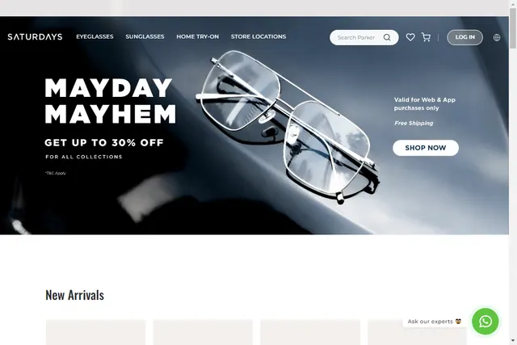</a><h4 align="center"><a href="https://saturdays.com/">Saturdays</a></h4>
Largest eyewear shop in India. <b>Next.js · Tailwind · TypeScript</b>
</td>
<td width="33%" valign="top"><a href="https://www.dteenergy.com/">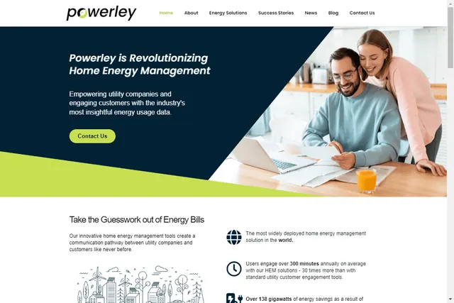</a><h4 align="center"><a href="https://www.dteenergy.com/">Powerley</a></h4>
Home energy management system. <b>Next.js · Tailwind · TypeScript</b>
</td>
<td width="33%" valign="top"><a href="https://play.google.com/store/apps/details?id=com.dteenergy.insight&hl=en">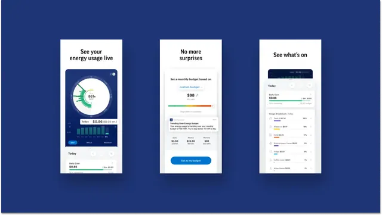</a><h4 align="center"><a href="https://play.google.com/store/apps/details?id=com.dteenergy.insight&hl=en">DTE Insight</a></h4>
Powerley home energy management mobile app. <b>React Native · Redux · NativeWind</b>
</td>
</tr>
<tr>
<td width="33%" valign="top"><a href="https://play.google.com/store/apps/details?id=com.saturdays">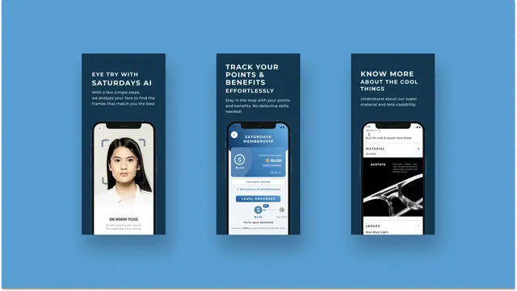</a><h4 align="center"><a href="https://play.google.com/store/apps/details?id=com.saturdays">Saturdays Lifestyle</a></h4>
E-commerce and eyewear tech mobile app. <b>React Native · Redux · NativeBase</b>
</td>
<td width="33%" valign="top"><a href="https://prospectgaze.com/">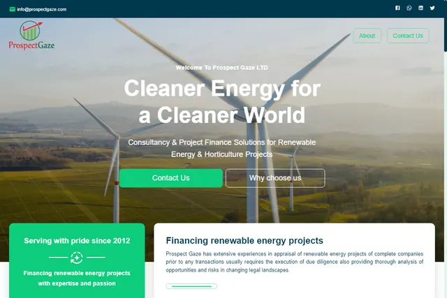</a><h4 align="center"><a href="https://prospectgaze.com/">Prospect Gaze</a></h4>
Company portfolio for Prospect Gaze Ltd. <b>React · Material UI</b>
</td>
<td width="33%" valign="top"><a href="https://rgbjute.co/">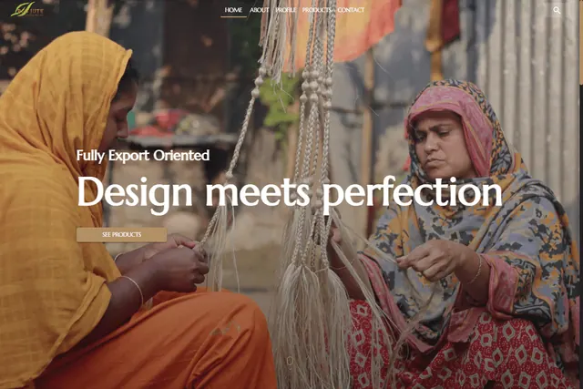</a><h4 align="center"><a href="https://rgbjute.co/">RGB Jute</a></h4>
Product portfolio with custom design and theming. <b>React · Material UI · Airtable</b>
</td>
</tr>
</table>

<picture><source media="(prefers-color-scheme: dark)" srcset="img/lorecraft/h-process-dark.svg"><source media="(prefers-color-scheme: light)" srcset="img/lorecraft/h-process-light.svg"></picture>

<table align="center">
<tr>
<td width="33%" valign="top"><b>01 · Understand</b> Customers, business rules and the numbers that define success.</td>
<td width="33%" valign="top"><b>02 · Shape</b> Scope, architecture and the right stack for this product and team.</td>
<td width="33%" valign="top"><b>03 · Build with AI</b> Small, reviewed increments. AI drafts and tests beside me; I own every line.</td>
</tr>
<tr>
<td width="33%" valign="top"><b>04 · Secure & verify</b> Tests, security checks and AI-assisted review on every change.</td>
<td width="33%" valign="top"><b>05 · Launch</b> CI/CD, monitoring and a calm release, web, mobile or both.</td>
<td width="33%" valign="top"><b>06 · Measure & iterate</b> Real usage, real fixes. The product keeps improving after launch.</td>
</tr>
</table>

<picture><source media="(prefers-color-scheme: dark)" srcset="img/lorecraft/h-stack-dark.svg"><source media="(prefers-color-scheme: light)" srcset="img/lorecraft/h-stack-light.svg"></picture>

<i>I choose tools for the product and the team that has to live with the code, not out of habit. AI sits in every step: drafting, testing, reviewing and securing.</i>

<b>✦ DAILY DRIVERS ✦</b> 

<b>✦ AI & LLM ENGINEERING ✦</b> 

<b>✦ AI-POWERED WORKFLOW ✦</b> 

<b>✦ WEB ✦</b> 

<b>✦ MOBILE & EVERYWHERE ✦</b> 

<b>✦ BACKEND & APIS ✦</b> 

<b>✦ DATA ✦</b> 

<b>✦ CLOUD & DEVOPS ✦</b> 

<b>✦ QUALITY & SECURITY ✦</b> 

<b>✦ LANGUAGES ✦</b> 

<b>✦ DESIGN & MOTION ✦</b> 

<picture><source media="(prefers-color-scheme: dark)" srcset="img/lorecraft/h-experience-dark.svg"><source media="(prefers-color-scheme: light)" srcset="img/lorecraft/h-experience-light.svg"></picture>

<picture><source media="(prefers-color-scheme: dark)" srcset="img/lorecraft/timeline-dark.svg"><source media="(prefers-color-scheme: light)" srcset="img/lorecraft/timeline-light.svg"></picture>

<picture><source media="(prefers-color-scheme: dark)" srcset="img/lorecraft/h-stats-dark.svg"><source media="(prefers-color-scheme: light)" srcset="img/lorecraft/h-stats-light.svg"></picture>

<picture><source media="(prefers-color-scheme: dark)" srcset="https://github-readme-stats.vercel.app/api?username=MrNewaz&show_icons=true&include_all_commits=true&count_private=true&border_radius=18&bg_color=135,0B0816,221642&title_color=F6D68C&icon_color=D6AC5C&text_color=E8E6E0&border_color=3A2A5E&ring_color=D6AC5C"><source media="(prefers-color-scheme: light)" srcset="https://github-readme-stats.vercel.app/api?username=MrNewaz&show_icons=true&include_all_commits=true&count_private=true&border_radius=18&bg_color=135,F6F1E5,ECE3F5&title_color=8A5F12&icon_color=A87A26&text_color=1A1230&border_color=D8C39A&ring_color=A87A26"></picture>
<picture><source media="(prefers-color-scheme: dark)" srcset="https://github-readme-stats.vercel.app/api/top-langs/?username=MrNewaz&layout=compact&langs_count=10&border_radius=18&bg_color=135,0B0816,221642&title_color=F6D68C&text_color=E8E6E0&border_color=3A2A5E"><source media="(prefers-color-scheme: light)" srcset="https://github-readme-stats.vercel.app/api/top-langs/?username=MrNewaz&layout=compact&langs_count=10&border_radius=18&bg_color=135,F6F1E5,ECE3F5&title_color=8A5F12&text_color=1A1230&border_color=D8C39A"></picture>

<picture><source media="(prefers-color-scheme: dark)" srcset="https://streak-stats.demolab.com?user=MrNewaz&border_radius=18&background=135,0B0816,221642&border=3A2A5E&stroke=3A2A5E&ring=D6AC5C&fire=F6D68C&currStreakNum=F6D68C&sideNums=E8E6E0&currStreakLabel=D6AC5C&sideLabels=A9A3B4&dates=6F6880"><source media="(prefers-color-scheme: light)" srcset="https://streak-stats.demolab.com?user=MrNewaz&border_radius=18&background=135,F6F1E5,ECE3F5&border=D8C39A&stroke=D8C39A&ring=A87A26&fire=8A5F12&currStreakNum=8A5F12&sideNums=1A1230&currStreakLabel=A87A26&sideLabels=4F4763&dates=7D7590"></picture>

<picture><source media="(prefers-color-scheme: dark)" srcset="img/lorecraft/h-hire-dark.svg"><source media="(prefers-color-scheme: light)" srcset="img/lorecraft/h-hire-light.svg"></picture>

<b>7+ years, 30+ shipped products and platforms serving 100k+ users.</b> You get one senior owner who understands the business, builds with AI to move faster, and hands over code your team can keep building on.

<table align="center">
<tr>
<td width="20%" valign="top"><h3 align="center">30%</h3>
faster platform Powerley
</td>
<td width="20%" valign="top"><h3 align="center">20%</h3>
SEO uplift Powerley
</td>
<td width="20%" valign="top"><h3 align="center">35%</h3>
fewer network calls Supertal
</td>
<td width="20%" valign="top"><h3 align="center">100+</h3>
restaurants onboarded Raaga, Ferntech
</td>
<td width="20%" valign="top"><h3 align="center">25%</h3>
lift in online sales RGB Jute
</td>
</tr>
</table>

<table align="center">
<tr>
<td width="33%" valign="top"><b>Full-time</b> Senior or lead engineer on your team. Remote-first, owning features and products from brief to launch.</td>
<td width="33%" valign="top"><b>Contract</b> Embedded with your team for a sprint or a season: a migration, an AI feature, a performance push.</td>
<td width="33%" valign="top"><b>Project</b> A clear scope delivered end to end: discovery, architecture, build, launch and support after it.</td>
</tr>
</table>

 

<a href="mailto:info@engineersaif.com?subject=From%20GitHub&body=Hi%20Saif%2C%20found%20you%20on%20GitHub."><picture><source media="(prefers-color-scheme: dark)" srcset="img/lorecraft/footer-dark.svg"><source media="(prefers-color-scheme: light)" srcset="img/lorecraft/footer-light.svg"></picture></a>

<picture><source media="(prefers-color-scheme: dark)" srcset="img/lorecraft/divider-dark.svg"><source media="(prefers-color-scheme: light)" srcset="img/lorecraft/divider-light.svg"></picture>

<h3 align="center"><i>Since you came this far, this one is for you</i> ❤️</h3>

